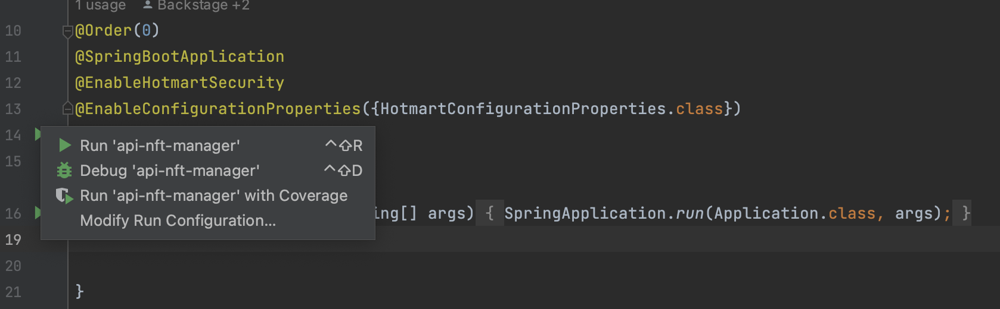
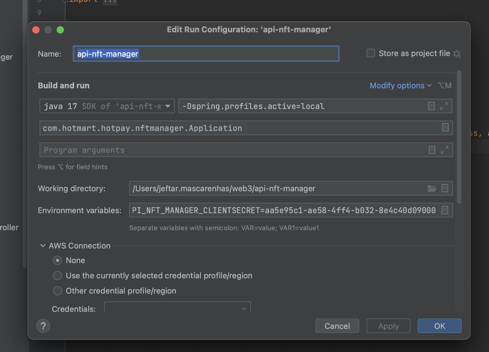

# API NFT Manager Mac OS configuration
This readme approaches the api nft manager configuration.
Before start make sure if you do the basic java configuration using [JAVA DOC](../../java/README.md)

## VPN with FortiClient
Loggin on VPN with FortiClient

## SSO LOGIN
Login to SSO

```shell
hotctl sso login
```

## AWS env config
Adding env AWS to local, but you could set staging with `buildstaging=staging`

```shell
hotctl sso accounts apply -n buildstaging=local
```
Result before command above
```shell
INFO[0002] Applying to credentials file account buildstaging with role Developers 
INFO[0002] Successfully write local account credentials to /Users/{your_user}/.aws/credentials 
INFO[0002] You can use it with AWS_PROFILE=local 
```
....

## Code artifact AWS

```shell
hotctl codeartifact token --profile buildstaging
```
Result before command above
```shell
INFO[0002] Applying to credentials file account buildstaging with role Developers 
INFO[0002] Successfully write local account credentials to /Users/{your_user}/.aws/credentials
INFO[0002] You can use it with AWS_PROFILE=local 
```

## Get credentials for project
Get credentials

```shell
hotctl secret get --service client-credentials/service/api-wallet-nft --profile buildstaging
```
Result before command above
```shell
INFO[0001] Applying to credentials file account buildstaging with role Developers
INFO[0001] Successfully write buildstaging account credentials to /Users/{your_user}/.aws/credentials
INFO[0001] You can use it with AWS_PROFILE=buildstaging
INFO[0010] Applying to credentials file account buildstaging with role Developers
INFO[0010] Successfully write buildstaging account credentials to /Users/{your_user}/.aws/credentials
INFO[0010] You can use it with AWS_PROFILE=buildstaging
client-credentials/service/api-wallet-nft:clientId=f94d4c9e-538d-4dfe-948e-cdd384705dcd
client-credentials/service/api-wallet-nft:clientSecret=ca309e8c-8bac-45d2-a4f1-75347469b7e1
```

## Config run configuration application on IntelliJ IDEA
*Modify run configuration*


*Set project configuration*

```shell
# Add this code snippet in the Environment Variables option in the window Edit Run Configuration
CLIENT_CREDENTIALS_SERVICE_API_WALLET_NFT_CLIENTID=f94d4c9e-538d-4dfe-948e-cdd384705dcd;CLIENT_CREDENTIALS_SERVICE_API_WALLET_NFT_CLIENTSECRET=ca309e8c-8bac-45d2-a4f1-75347469b7e1
```



## Solve Errors

If exist any error that was solved describe here

```shell
adding code snippet
```
